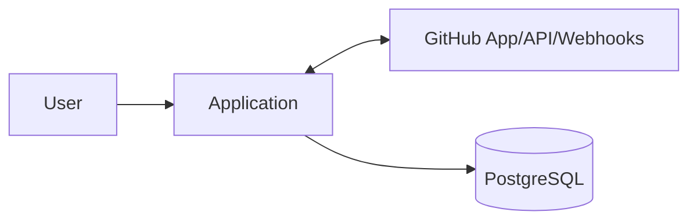
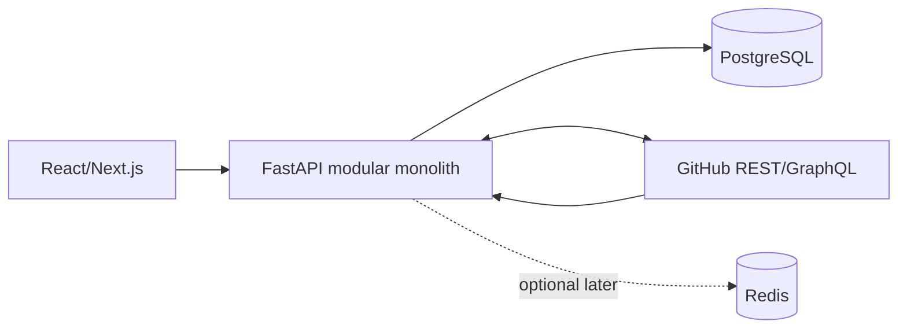

# Arquitetura

## Modular monolith

Backend Python/FastAPI, PostgreSQL/SQLAlchemy/Alembic, frontend React/Next.js TypeScript. Redis fica fora do baseline; introduzir somente para necessidade comprovada de jobs, cache ou rate coordination. Jobs podem começar com tabelas de outbox/inbox e worker no mesmo deploy.

## Módulos

`identity` (auth/session), `tenancy`, `github` (gateway, installation, adapters), `issues` (projection/relations/commands), `projects_workflows`, `collaboration` (comments/updates/activity), `sync` (inbox/reconcile), `views`, `notifications`, `audit`, `shared`.

Infraestrutura GitHub não deve vazar para regras de domínio; gateways traduzem REST/GraphQL e erros.

## Context diagram

## Container diagram

## Eventos internos

Domain events: `IssueProjectionUpdated`, `WorkflowStageChanged`, `CommentConfirmed`. Integration events: `GitHubWebhookReceived`, `SyncRequested`, `GitHubMutationFailed`. Webhook event é o envelope externo; audit event é registro de ação do produto. Não publicar todo CRUD; somente fatos que desacoplam projeção, activity, notificações ou métricas.
