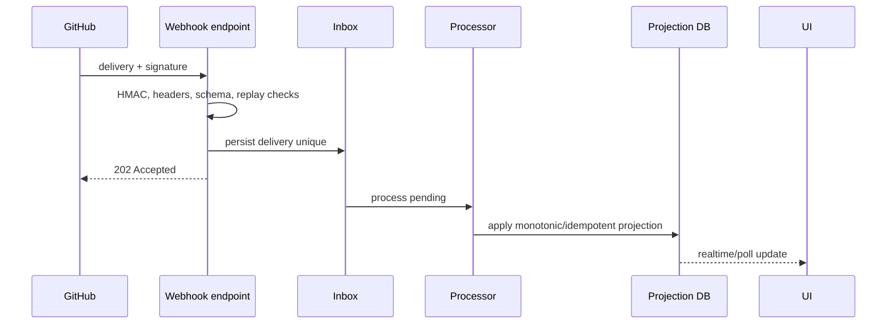
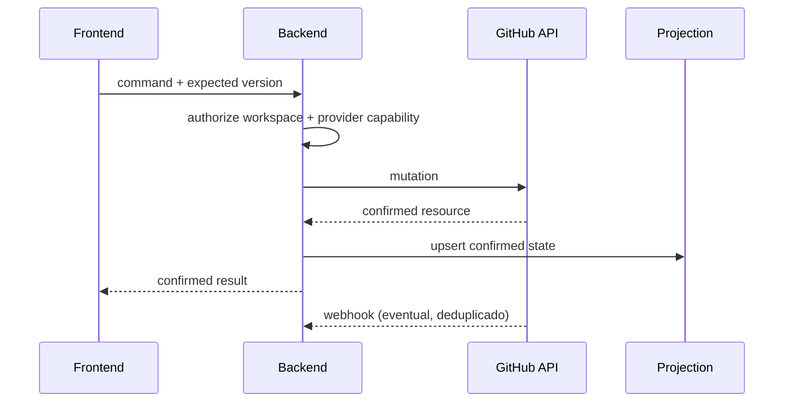

# Sincronização

## Fluxo

## Inbox e ordering

Unique key é delivery id. Armazenar event/action, installation, repository, received_at, payload hash, status, attempts, processed_at e erro. Payload inválido não entra no fluxo de domínio. Eventos antigos são ignorados por `source_updated_at` quando confiável; relações/status ambíguos disparam refetch.

## Reconciliação

Importação inicial pagina Issues, comentários, sub-issues, dependencies e Project values. Reconciliador periódico revisita recursos ativos e erros; após downtime usa inbox pendente e janela temporal baseada em `updated_at`, sem presumir cursor universal. Tombstones detectam remoções quando API/listagem deixar de retornar o item. Admin pode solicitar resync de repository/Issue.

## Mutação aplicação -> GitHub

## Retries e rate limit

Retry apenas erro transitório, com backoff e jitter. Respeitar `retry-after` e `x-ratelimit-reset`; reduzir concorrência e priorizar webhook/importação. Mutação de criação usa resposta/ID como chave; se timeout após envio, consultar/reconciliar antes de repetir.

## Estados de sync

`healthy`, `pending`, `degraded`, `permission_denied`, `revoked`, `removed`. UI exibe `last_successful_sync`, lag, erro resumido e ação de recuperação.
