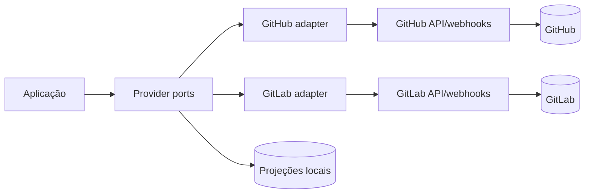

# Integrações SCM

## Objetivo

A aplicação integra-se a um provider de source control management (SCM) conectado ao workspace. GitHub e GitLab são adapters independentes de uma mesma camada de aplicação; nenhum provider é tratado como autoridade universal do produto.

O provider conectado é a autoridade dos dados nativos que ele possui. A aplicação é autoridade de workspace, permissões locais, workflow interno, auditoria, sincronização e projeções derivadas.

## Arquitetura

Os casos de uso dependem de ports normalizadas, nunca de SDK ou tipo nativo de um provider. Cada adapter traduz autenticação, paginação, erros, webhooks e recursos nativos para os contratos internos.

## Escopo

- GitHub Cloud é provider suportado no MVP.
- GitLab.com é provider suportado no MVP.
- GitLab Self-Managed é uma variação arquiteturalmente suportada, condicionada a URL, versão, configuração e conectividade da instância.
- GitHub Projects e GitLab Issue Boards são capacidades específicas; não são o workflow interno por definição.

## Não objetivos

- Não criar uma Issue ou Issue local concorrente.
- Não sincronizar work items entre GitHub e GitLab.
- Não esconder limitações de capability com dados fictícios.
- Não exigir que todos os providers ofereçam a mesma semântica.

## Contrato de consistência

Leituras podem ser cacheadas. Uma mutação externa só é `confirmed` após resposta de sucesso do provider. Webhooks aceleram a atualização, mas reconciliação paginada é necessária para recuperar perda, atraso ou reordenação de eventos.

## Referências

- [Modelo normalizado](normalized-domain-model.md)
- [Capabilities](provider-capabilities.md)
- [Catálogo de APIs](api-catalog.md)
- [Matriz de operações](api-operation-matrix.md)
