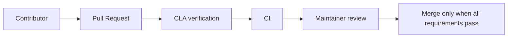

# Legal Readiness Checklist

Internal planning checklist. This is not legal advice and does not establish compliance. Items marked incomplete require technical, operational, and/or professional legal review.

## Current baseline

- [x] Proprietary `LICENSE` exists with All Rights Reserved language.
- [x] No open-source SPDX identifier was added for the project.
- [x] README states that public source visibility does not grant a license.
- [ ] Legal owner/entity structure confirmed: **TBD**.
- [ ] Legal contact and notice address defined: **TBD**.
- [ ] Governing law and dispute forum defined: **TBD**.

## Before accepting external contributions

- [ ] LICENSE reviewed.
- [ ] CLA reviewed legally.
- [ ] CONTRIBUTING consistent with CLA.
- [ ] CLA acceptance process defined.
- [ ] Contributor identity and entity-signing process defined.
- [ ] Policy for third-party dependencies defined.
- [ ] Provenance and copyright review process defined.
- [ ] Contribution records and withdrawal/correction process defined.
- [ ] Automated CLA verification decision made.

## Before private beta

- [ ] Terms reviewed.
- [ ] Privacy reviewed.
- [ ] Data deletion flow implemented and tested.
- [ ] GitHub App permissions reviewed.
- [ ] SECURITY updated with a real private reporting channel.
- [ ] Subprocessors identified.
- [ ] Retention policy defined.
- [ ] Data inventory and processing register created.
- [ ] Incident response process defined.
- [ ] Workspace and tenant isolation tested.
- [ ] User-access and GitHub-permission model validated.

## Before public launch

- [ ] Professional legal review of Terms.
- [ ] Professional legal review of Privacy Policy.
- [ ] LGPD review.
- [ ] Controller/processor roles analyzed.
- [ ] Legal bases defined.
- [ ] Privacy contact defined.
- [ ] Security contact defined.
- [ ] Retention periods defined.
- [ ] Data-subject request process defined.
- [ ] Subprocessors documented.
- [ ] International transfers analyzed and safeguards selected.
- [ ] Cookies and analytics analyzed.
- [ ] Backups and deletion analyzed.
- [ ] Incident response defined and exercised.
- [ ] Accessibility and consumer-protection review completed where applicable.
- [ ] Dependency notices generated and reviewed.
- [ ] Trademark and branding review completed.
- [ ] Support, pricing, cancellation, and refund terms defined if applicable.
- [ ] SLA decision documented; no SLA is promised until then.

## GitHub contribution flow

Recommended future flow:

The project should later choose whether to use a GitHub App, bot, or Action for CLA verification. No App, bot, Action, or dependency is installed by this task. Merge protection should prevent merging when a required CLA check is unsatisfied, subject to the final workflow and legal instrument.

## Cross-document review

- `LICENSE` and `README.md` consistently describe proprietary, All Rights Reserved software and do not grant public use rights.
- `CONTRIBUTING.md` states that contributions do not make the project open source and points to the draft `CLA.md`.
- `CLA.md` proposes a broad contribution license while retaining contributor copyright; it does not silently choose copyright assignment and remains blocked on legal review and acceptance mechanics.
- `TERMS.md` and `PRIVACY.md` are both explicitly pre-launch drafts and avoid committing to jurisdiction, contacts, retention, SLA, providers, or final legal bases.
- `TERMS.md` distinguishes GitHub ownership and permissions from the proprietary project; it also states that the service is not affiliated with GitHub unless formally true.
- `PRIVACY.md` distinguishes consulted, processed, stored, and temporary/cache data and refers to the existing security architecture without claiming absolute security or legal compliance.
- `SECURITY.md` aligns with the security architecture and uses `TBD` instead of inventing a reporting address.
- `THIRD_PARTY_NOTICES.md` separates product licensing from dependency licensing and postpones generated notices until dependency manifests exist.

No blocking contradiction was found in the current documentation. Final legal review remains required before accepting external contributions, processing real user data, or launching the service.
